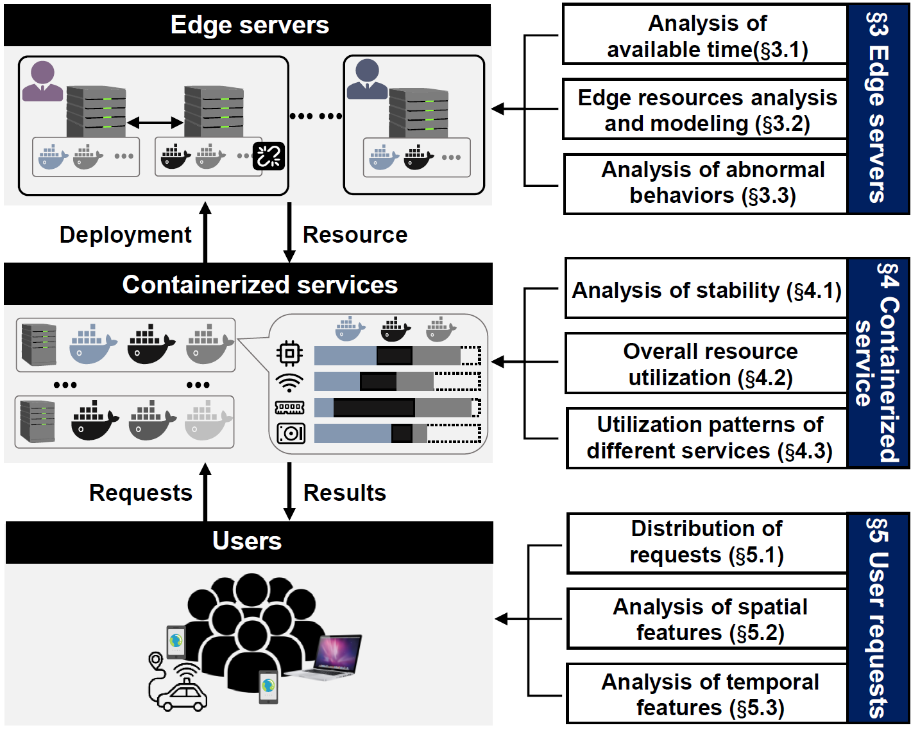

# Flexible Measurement-based Modeling Generators

### About

In order to facilitate the interested reader to better apply our measurement findings, we have implemented the complete modeling generator based on Python and provided the necessary quantitative data to support it. In addition, this project uses GDP as well as geographic data from some regions of the USA as an example to help readers understand the implementation details. Hope this project can provide a real experience for the research and application of edge computing.


Note: The GDP and geographic data used in this project are obtained from Wikipedia.

### Overall



As shown above, this research provides a holistic measurement analysis of a crowdsourced edge platform, focusing on three dimensions (servers, services, and requests) to answer the following questions:

+ What are the quality and quantity characteristics of the hardware resources provided by C-ESP’s **edge servers**?
+ What are the stability and utilization characteristics of the **containerized services** hosted on C-ESP?
+ What are the spatial and temporal distribution characteristics of **user requests** handled by C-ESP?

Among them, the data generation for edge servers is the most complicated and is divided into 5 steps as shown in the figure below.


 

### Prerequisites

The code runs on Python 3. To install the dependencies, please execute:

```
pip3 install -r requirements.txt
```


### Project

- quantified_data - Includes the measurement data to support the project
- input_data - Includes GDP/population and geographic data for the target area as input, and currently is some regions of the USA
- output_data - includes the output result data obtained by running the project

### Getting Started

* Input data: You can use the population/GDP and geographic data of the target area as input. At the same time, we also provide the data sample in ./input_data.
* Parameter setting: Set up in main.py according to your own needs.
* Run:  ` python3 main.py`
* Result: Read and analyze the file in "\out".

### Main Process

* **Edge Server:** Input GDP/population data and geographic data of any target area, the corresponding edge server model that matches the distribution pattern of the real data set can be output.
* **Containerized Service:** Input any container type corresponding to Fig. 9 in the paper (e.g., [7, 5, 15, 7] four containers), it can output the resource variations of the containerized service over the day that match the distribution pattern of the real dataset.
* **User Request:** Input the number of users (e.g., 132034) and the length of time required for the data (e.g., 30), it can be generated per user request in every second.

### Version
* 1.0

### Citation

If this paper can benefit your scientific publications, please kindly cite it.

```
Shihao Shen, Yicheng Feng, Mengwei Xu, Cheng Zhang, Xiaofei Wang, Wenyu Wang, Victor C.M. Leung. A Holistic QoS View of Crowdsourced Edge Cloud Platform. IEEE/ACM International Symposium on Quality of Service (IWQoS). 2023.
```

